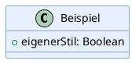

# kd.py – Klassendiagramme aus PlantUML

Ein einzelnes, abhängigkeitsfreies Python-Skript, das aus PlantUML-Text ein Klassen- oder Objektdiagramm als SVG erzeugt – mit einem fertigen Design-Preset, das sich bei Bedarf komplett überschreiben lässt.

## Voraussetzungen

- [uv](https://docs.astral.sh/uv/) (führt das Skript ohne Installationsschritt aus)
- [PlantUML](https://plantuml.com/download) lokal installiert, inklusive Java. Auf macOS z. B.:
  ```bash
  brew install plantuml
  ```

## Verwendung

```bash
# Aus einer .puml-Datei
uv run kd.py diagramm.puml

# Direkt als Text (mehrzeilig, in Anführungszeichen)
uv run kd.py "class Foo {
  +bar: Text
}"

# Über stdin
cat diagramm.puml | uv run kd.py -

# Anderes Design-Preset
uv run kd.py diagramm.puml --theme dark

# Ziel-Datei explizit festlegen
uv run kd.py diagramm.puml -o ausgabe.svg

# Ohne Zwischenablage (z. B. auf einem Server ohne Clipboard-Zugriff)
uv run kd.py diagramm.puml --no-clipboard
```

Nach dem Rendern:
- landet die vollständige SVG-Datei neben dem Input (bzw. als `diagramm.svg`, wenn kein Dateiname bekannt ist),
- wird zusätzlich eine leicht aufgeräumte Embed-Version (ohne PlantUML-Metadaten) in die Zwischenablage kopiert – zum direkten Einfügen in eine Markdown-Zelle (z. B. Jupyter Notebook) oder eine Webseite.

## Design anpassen

Drei eingebaute Presets: `tgi` (Standard, warmer Skript-Stil), `dark`, `minimal`.

Wer ein komplett eigenes Design will, schreibt einfach selbst einen `skinparam`-Block in den PlantUML-Input – das Skript erkennt das automatisch und wendet dann **kein** Preset an:



Siehe `examples/` für lauffähige Beispiele.

## Warum lokal statt Web-Dienst?

Es gibt Web-Dienste wie [Kroki.io](https://kroki.io), die PlantUML ohne lokale Installation rendern. Dieses Skript setzt bewusst auf die lokale `plantuml`-Installation, weil das Ergebnis dadurch exakt reproduzierbar bleibt und kein Diagrammtext an einen externen Dienst geschickt wird.
